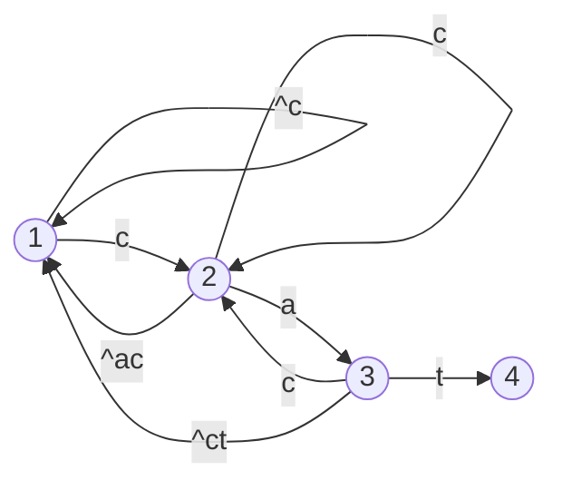

# 组合计数问题

## 加法原理和乘法原理

如果一个过程有 K 种不同的分类，每种分类分别有 $ A*1, ... A_k $ 种可能，那么该过程总计有 $ \sum_{i=1}^kAi $ 种可能，就是所有的可能数加起来。需要注意的是，任何一个过程的可能性必须归属于一个且仅一个分类，不能有遗漏或重复。

如果一个过程有 K 个相互独立的阶段，每个阶段分别有 $ A*1, ... A_k $ 种可能，那么该过程总计有 $ \prod_{i=1}^kAi $ 种可能，就是每个阶段的可能性乘起来。需要注意的是，阶段之间必须相互独立，意味着一个阶段方案的变化，不能影响其它阶段的计数。

偶尔还会有反向运用加法原理（俗称减法原理），若一个过程有且仅有两种分类，已知其中一种分类的数量为 $ a $，总的数量为 $ S $，那么另一种分类的数量为 $ S-a $ 

## 容斥原理

在使用加法原理计算时，必须没有重复和遗漏。如果存在重复，可以使用容斥原理排除。

容斥原理的简单表述是，两个集合的并集的计数，等于两个集合的数目之和，减去两个集合的交集的数目之和。

更一般性的表述：

$$
\begin {split}
& |A_1 \cup A_2 \cup A_3 \cup ... \cup A_m|  \\
& = \sum_{1 \le i \le m}|Ai| - \sum_{1 \le i \lt j \le m} |Ai \cap Aj| + \sum_{1 \le i \lt j \lt k \le m } |Ai \cap Aj \cap Ak| .... + (-1)^{m-1}|A1 \cap A2 \cap ... \cap A_m| \\
\end {split}
$$

或写作：

$$
| \bigcup_{i=1}^{n}Ai|  = \sum_{k=1}^{n}(-1)^{k-1}\sum_{1 \le i_1 \lt i_2 \lt ... \lt i_k \le n} |A_{i_1}\cap A_{i_2} \cap ... \cap A_{i_k}|
$$

不过一般情况下，为了更低的算法复杂度，我们更常采用逐个加入集合迭代的方式逐步计算所有集合的并集大小，而非使用上述的一般形式（一般形式需要 $ O(2^N) $时间复杂度）

## 概率计算

许多概率计算题和组合技术问题有天然的联系，因为以下两个表述是等价的：

* 在一个问题所有可能的组合里，有多少的比例符合条件A？
* 如果该问题所有可能的组合等概率出现，有多大的概率条件A为真？

## 分治法

很多计数问题也被叫做DP问题，正是因为它利用分治法的思路和DP一致：试图将大问题分解成更小规模的问题，从而求得递归公式。

和DP问题一样，有时候，问题需要进行一些变形，引入一些新的维度，然后才能变成可以列出递归公式的形式。

## 映射法

如果能够构造一种运算，使一个集合里的每个元素都一一对应另一个集合里的元素，那么这两个集合的数量就是一样的。

如果能构造一种运算，使一个集合里的元素转换成另一个集合里的元素，且该运算可逆，那么这两个集合的数量就是一样的。

有时候，一个组合计数问题被表达成多个过程，但过程间可能不是独立的。此时如果通过映射法，可以更换过程间的顺序，或者使用某种新的过程来替代其中的一些过程，从而使过程间独立，就能更有效的运用乘法原理和现有组合公式来求解。

## 数学变形

数学变形当然在许多问题里同等的重要。

类似于映射法，在一个组合公式里，更换变量枚举的顺序也许可以合并计算或消除某些项，得到一个简单的多的公式。

也有许多项可以拆开分别求解。

如果你确实写出了一个很复杂的公式，并对它的正确性有信心，可以尝试先化简它，寻求能抵消或合并计算的项。

## 分球问题/球盒问题

分球问题是一系列经典组合问题，许多问题都可以映射到分球问题上，从而取得解决方案。
分球的8个问题是针对以下三个条件的不同回答产生的8个不同的问题：

* 球是否相同
* 盒子是否相同
* 盒子是否允许为空

> [分球的八个问题](https://zhuanlan.zhihu.com/p/462642014)

> [球盒问题：这篇笔记来就全算完了](https://zhuanlan.zhihu.com/p/429815465)

## 用于降低复杂度的数学/算法工具

常见快速求解方法有（这里不一一介绍了）

* [范德蒙德卷积](https://zhuanlan.zhihu.com/p/552934763)：用于组合式优化、化简等
* 前缀和/后缀和：常用于连续计算优化
* 线段树(segment_tree)/树状数组(fenwick_tree)：常用于区段求和，经常可以有效把某个线性复杂度的查询变为 $lgN$ 复杂度
* 离散化：有时候复杂度与数据的取值范围而不是数量相关，而取值范围比数量更大。有时可以将所有的可能取值排序，用序号替代原值，可保留相对大小关系，以便于进行区段求和等操作。
* 矩阵，矩阵乘法：用矩阵乘法可快速求线性变换；很多幂求和问题都可以转换为线性变换问题；还利用轮换矩阵构造 $ B^k=I $ 来优化二项式间隔取数求和问题。
* 卷积（AtCoderLibrary里有[现成的](https://github.com/atcoder/ac-library/blob/master/atcoder/convolution.hpp)），建议背板/抄板，不建议死磕原理。
* [母函数/生成函数](https://blog.csdn.net/qq_41357771/article/details/83449481)：常用于通过递推公式求解通项公式（不过通常包含无理数和指数函数，不适用于精确求解或者取模求解）。也有许多其它的用途。对于线性递推式来说，母函数的解通常和矩阵的特征值有某些奇妙的关联。

# 例题

## [ARC 153 A - AABCDDEFE](https://atcoder.jp/contests/arc153/tasks/arc153_a)

**题意**：求第N小的，满足 `AABCDDEFE` 形式的整数。

**思路**：这不是一道计数题，但同样可以采用映射法解决。

考虑整数 `ABCDEF`，其和所有 `AABCDDEFE` 形式的整数一一对应，且满足大小关系一致。
因此可以在这两种形式之间构建映射关系，求出第N小的 `ABCDEF` ，再通过字符串处理或数位处理将其处理输出即可。

很显然，最小的满足条件的数是 `100000` ，易推出第N小的是 $99999+N$ 。

## [括号匹配问题](https://www.bilibili.com/video/BV1hK4y1s7Ln/?vd_source=3f69a845e840bc8c8485d6659562b605)

**题意**：问N组括号，有多少种合法的排列方式（合法指括号能两两配对）

**思路**：之前非常深入的讲过，这里就不冗述了。

运用分治法很容易得出一个 $O(N^2)$ 的算法。

运用减法原理+映射法，将不合法方案映射到另一个组合上，可以得出通项公式 $C(2N, N) - C(2N, N-1)$

该公式就是卡塔兰数。

## catcat

**题意**：问有多少个长度为N的小写字母串，其中恰好出现了两次连续的cat

**思路**：设立状态机来表达“恰好出现两次连续的cat”，其第一段类似如下



用这种办法继续构造到三段，可以发现状态1-3表示0个cat，4-6表示1个cat，7-9表示2个cat，10表示3个或3个以上cat。记录数组 $DP[i][s]$ 表示长度为 $i$ 的串，处在状态 $s$ 的组合数，即可在 $O(N*(|V|+|E|))$时间内求出 $DP[N]$ ，且最终所求 $ans = \sum_{i \in \{7,8,9\}} DP[N]$ 。

因为 $DP$ 符合线性递推式形式，所以如果 $N$ 比较大，还可以构造矩阵，使用快速幂方法，在 $O(|V|^3lgN)$ 时间内求解。

## [POJ 3387 - Crazy Thairs](http://poj.org/problem?id=3378)

POJ唯一一道本人出的题

**题意**：给一个数组，问有多少组 $\{i,j,k,l,m\}$ 满足：

1. $1\le i<j<k<l<m\le N$
2. $A_i<A_j<A_k<A_l<A_m$

**思路**：逆序数对很多同学学过利用归并排序间接计算，该方法也可以通过此方法完成。但这里我们介绍思路上更简单的通解：

* 首先运用离散化，可在保留相对大小关系的前提下将数组成员取值范围约束至 $N$ 以内。
* 按顺序遍历数组，用树状数组记录到当前位置为止每个取值出现的次数，这样可以通过区段求和在 $O(NlgN)$ 时间内求出每个元素之前比它小的数的个数，即为针对每个 $j$ ，求满足 $i<j$ 和 $A_i<A_j$ 的组合数，记录为 $Bi$ 。
* 再次遍历数组，此时用树状数组记录到当前位置为止每个取值对应的 $Bi$ 之和，这样再次区段求和即可求出针对每个 $k$ ，满足 $i<j<k$ 和 $A_i<A_j<A_k$ 的组合数
* 以此类推，再进行两轮遍历，即可完成本题。

这题还有一个恶心人的点：结果会超出uint64的范围，根据题目范围可推导最坏情况组合数为 $C_{50000}^5 = 2603645869790625010000 > 2^{64} = 18446744073709551616$ ，因此需要额外的处理。但是可以注意到，对每一个m来说组合数都没有超过uint64范围，因此线段树过程无需处理，仅在最后求和阶段做一个简单的大整数处理即可。

## 132排列问题，改编自[LC 456 - 132 模式](https://leetcode.cn/problems/132-pattern/)

**题意**：给一个数组，问有多少组 $\{i,j,k\}$ 满足：

1. $1\le i<j<k\le N$
2. $A_i<A_k<A_j$

> 原题是求解是否存在，比较容易构造一个 $O(NlgN)$ 的方法。经过改变，难度有所提升。

**思路**：$i,j,k$ 三者之间都有相关的约束，无法简单的像上一题一样利用区段求和处理，需要一些额外的思路。

通过前一题的思路引导，我们可以比较容易 $O(NlgN)$ 求解出满足 $A_i<A_j<A_k$ 的组合数。因此顺着这个思路思考，我们分别求出满足：

1. $A_i<A_j$ 且 $A_i<A_k$ 的所有组合数
2. $A_i<A_j\le A_k$ 的所有组合数

显然这里可以运用减法原理，从前者中排除掉后者，即为题目所求。

* 前者可以通过区段查询，针对一个特定的 $i$，得到所有满足 $A_i<A_m$ 的组合数量设为 $p$ ，从满足条件的 $m$ 中任意选择两个不同的数作为 $j,k$ 即可，共有 $p*(p+1)/2$ 种组合。
* 后者可以延续上一题的方法，仅需注意第二个符号为 $\le$ ，区段查询的范围需要对应调整即可。

```cpp
vector<int> a;

{
    // 离散化
    vector<int> v(A, A+N);
    sort(v.begin(), v.end());
    v.erase(v.unique(v.begin(), v.end()), v.end());
    unordered_map<int, int> um;
    for (int i = 0; i < v.size() ;i++) {
        um.insert(make_pair(v[i], i));
    }
    for (int i = 0; i < N; i++) {
        a.push_back(um[A[i]]);
    }
}

long long ret = 0;

{
    // 计算情况1
    fenwick_tree<int> fw(N);

    for (int i = N-1; i>=0; i--) {
        fw.add(a[i], 1);
        int p = fw.sum(a[i]+1, N);
        ret += p*(p-1)/2;
    }
}

{
    // 排除情况2
    fenwick_tree<int> fw(N);
    fenwick_tree<int> fw1(N);
    for (int i = N-1; i>=0; i--) {
        ret -= fw1.sum(a[i]+1, N);
        fw1.add(a[i], fw.sum(a[i], N));
        fw.add(a[i], 1);
    }
}
```


## [LC 923. 三数之和的多种可能](https://leetcode.cn/problems/3sum-with-multiplicity/)

**题意** 给定一个整数数组 arr ，以及一个整数 target 作为目标值，返回满足 i < j < k 且 arr[i] + arr[j] + arr[k] == target 的元组 i, j, k 的数量。

**思路** 首先这题值域很小，并且其实并不需要保证数组的顺序，所以可以先聚合求出每个数出现的次数。

然后基础解法是循环i，然后j,k双指针，可以在 $O(N+|S|^2)$ 时间完成。

但是我们可以注意到，在值域的计数公式很近似一个卷积，因此可以使用卷积求解。

值域的卷积计算结果会包含一些不符合要求的解：解中可能会包含 $i、j、k$中存在两个数相等，或者三个数均相等的情况，运用容斥原理予以排除。最终复杂度 $O(N+|S|*lg|S|)$。

**代码** [JS](https://leetcode.cn/problems/3sum-with-multiplicity/solution/ke-neng-shi-zui-di-de-fu-za-du-on-rlgr-by-dengyun/)

## [LC 576. 出界的路径数](https://leetcode.cn/problems/out-of-boundary-paths/)

**题意** 给你一个大小为 m x n 的网格和一个球。球的起始坐标为 [startRow, startColumn] 。你可以将球移到在四个方向上相邻的单元格内（可以穿过网格边界到达网格之外）。你 最多 可以移动 maxMove 次球。

给你五个整数 m、n、maxMove、startRow 以及 startColumn ，找出并返回可以将球移出边界的路径数量。因为答案可能非常大，返回对 109 + 7 取余 后的结果。

**思路** 首先可以直接DP， $DP[i][x][y]$ 表示i步后处在x、y位置的组合数。可以在计算过程中累加出界的路径数量。复杂度为 $O(m*n*maxMove)$ 。 然而我们可以进行一系列的改进：

* 显然水平移动不会改变纵坐标，垂直移动不会改变横坐标，对于任意一组没有出界的方案，我们可以假设其经过了H次水平移动，V次垂直移动，水平移动和垂直移动之间的组合，有$C(maxMove, H)$种。
* 对于水平移动和垂直移动，我们可以运用和前面相同的方法，使用一维DP求解。
* 运用减法原理，上一步的合法组合数*4-这一步的合法组合数，即为出界组合数。
* 因为对每一步而言，H+V是一个固定的数，这和卷积极其相似。在DP的结果上预除 $H!$ 和 $V!$ ，即可以利用卷积在 $O(maxMove*lg(maxMove))$ 时间完成后续求解。

这样，最终整体复杂度被降低到$O((n+m)*maxMove + maxMove*lg(maxMove))$。

> 注意组合数的 $O(N)$ 求解需要使用乘法逆元，这里偷懒使用 $O(lgN)$ 的逆元实现。

**代码**: [JS 未卷积优化 CPP卷积优化](https://leetcode.cn/problems/out-of-boundary-paths/solution/bu-shua-chu-quan-wang-zui-di-fu-za-du-bu-rzbu/)


## [ABC 279 G - At Most 2 Colors](https://atcoder.jp/contests/abc279/tasks/abc279_g)

**题意**：一个长度为N的串，每格可以是C种颜色之一。要求任意连续的K个格子都不超过2种不同的颜色。

问总共有多少种符合条件的串。

**思路**：考虑第i格颜色的可能性：如果最近的K-1个格子都是相同的颜色，我们下一格就可以任意选择一种颜色。但如果最近的K-1个格子不全是相同的颜色，我们下一格就只能在这两种颜色中选择。

而最近K-1个格子都是相同的颜色的任意组合，其前i-K+1格首先必须是合法的组合；反过来说，从前i-K+1格的任意一个合法组合，也可以唯一确定一个使其最近K-1格颜色全部相同的方案（因为最后一个颜色已经被确定下来了）。因此，最近K-1格都是相同颜色的组合总数，等于前i-K+1格的所有合法组合数。

另一方面，我们很难直接求最近K-1个格子里有两种颜色的组合数，但是所有的合法组合，其最近的K-1个格子一定都不超过两种颜色，所以运用减法原理，排除掉最近K-1个格子都是相同颜色的组合，即为最近K-1个格子里有两种颜色的组合。

因此设 $DP[i]$ 为前 $i$ 个格子的合法组合数，有：

$$
\begin{aligned}
DP[i] &= (DP[i-1]-DP[i-k+1])*2 + DP[i-k+1]*C \\
&=DP[i-1]*2 + DP[i-k+1]*(C-2)
\end{aligned}
$$

注意上面假设了 $i \ge k$。对于 $i \lt k$，显然颜色全部相同的恰好有 $C$ 种组合。

**代码**: [cpp](https://atcoder.jp/contests/abc279/submissions/38532428)

## [ABC 287 F - Components](https://atcoder.jp/contests/abc287/tasks/abc287_f)

**题意**：给一个树，针对1到N之间的每一个x，问该树有多少个“非空导出子图”，正好有x个连通块。

> 导出子图，指从原图中选定顶点的子集，若原图中某个边的两个顶点都在子图中，则该边也包含在子图中。 

**思路**：因为是一个树，考虑以某点为根的树，其能生成恰好k个连通块能否分解成子树上的子问题。

假设某方案，每个子树上分别有 $Ai$ 个连通块，经过分析发现会分为如下几种情况：

* 不选定整个树的根，得到 $\sum Ai$ 个连通块（所有的连通块之间都互相不连通）。
* 选定整个树的根，那么根可能会形成一个新的连通块。但子树中如果有k个根也被选中了，这k个连通块都会和根相连，因此总共得到 $(\sum Ai) - k$个连通块

可以看出数量与树的根，以及子树的根是否被选中相关，因此可以设 $DP[v][t][x]$ 表示：顶点 $v$ 的子树， $t=0$ 表示顶点 $v$ 被选定， $t=1$ 表示顶点 $v$ 不被选定，恰好有 $x$ 个连通块的组合总数。

计算每个DP值时，可以按照下述流程：

* 如果不选定整个树的根，先只考虑根，有0个连通块的1种组合方法，然后每多考虑一个新的子树v：
    * $T[x]$ 表示仅考虑根和该子树之前兄弟的所有子树的组合数，初始仅有 $T[0]=1$
    * $T'[x]$ 表示考虑根和该子树和该子树之前兄弟的所有子树的组合数
    * $C[x] = DP[0][t][x] + DP[1][t][x]$
    * $T'[x] = \sum_i^xT[i]*C[x-i]$
* 如果选定整个树的根，先只考虑根，有1个连通块的一种组合方法，然后每多考虑一个新的子树v：
    * $C[x] = DP[0][t][x] + DP[1][t][x+1]$ 这里+1意味着子树的根也被选中时，该连通块和根所在的连通块合并。
    * 仍然有$T'[x] = \sum_i^xT[i]*C[x-i]$

可以看出每多考虑一个子树，进行了一次 $O(N)$ 的求和，因此如果如上述暴力实现，复杂度为 $O(N^3)$ 。但是我们可以做如下优化：

1. 对每个顶点 $v$ ，$x$ 最多不超过其子树的顶点数量，因此我们应当仅计算，也仅使用不超过子树顶点数量的 $x$ 。 这样可以证明整体复杂度上界为 $O(N^2)$ 
2. 上面的连续乘法求和过程，本质上就是一个**卷积**，可以直接使用NlgN的卷积算法批量完成，这样在大多数平衡的情况都可以提升计算效率（虽然最坏情况下可能退化到 $O(N^2lgN)$ ，可以调整FFT和朴素卷积的判断条件，使退化不超过 $O(N^2)$ ）

代码 [非卷积CPP](https://atcoder.jp/contests/abc287/editorial/5641) [卷积CPP](https://atcoder.jp/contests/abc287/submissions/38410438)

## [ABC 282 G - Similar Permutation](https://atcoder.jp/contests/abc282/tasks/abc282_g)

**题意**：求有多少对相似度恰好为K的N排列，结果模P输出。相似度定义为，两个排列中，相同的一组相邻下标的大小关系相同：

$$
(A_{i+1}-A_i)(B_{i+1}-B_i) > 0
$$

**思路**：和刷过的DP题：[T-Permutation](./atcoder_dp/README.md#t---permutation)几乎一模一样，只是维度升高了一维。

按我们的表述：每往排列里插入一个元素 $ i $ ，就把之前 $ \ge i $的数字全加1。反过来说，从排列里拿掉最后一个元素 $i$ 的子状态，就把之前 $ \gt i $的数字全减1，以一一对应一个 $ 1...n-1 $的排列。

DP定义： $ DP[i][j][k][l] = (前i个元素，相似度为k，且A排列最后一个元素为k，B排列最后一个元素为l的组合总数)$

迭代时，就分为两类情况：

* 符号相同，对应两个串的符号分别为 $ <, < $ 或 $ >, > $ ；
* 符号不同，对应两个串的符号分别为 $ <, > $ 或 $ >, < $ ；

每一种符号组合分别都对应这上一层DP的区块求和，这个可以很容易通过二维前缀和预处理后 $ O(1) $ 计算来完成。

**代码** [CPP](https://atcoder.jp/contests/abc282/submissions/37446986)

## [ABC 281 G - Fasthest City](https://atcoder.jp/contests/abc281/tasks/abc281_g)

**题意**：求有多少个无向图，满足N号顶点是唯一距离1号顶点最远的点。

**思路**：N号顶点是距离1号最远的点，如果从起点开始按最短距离一层层添加点，N独属最后一层，单独处理。

每添加一层顶点时，每个顶点至少有一个连通上一层的边（满足最短距离要求），可以随意连接多个；另外，同一层的顶点中可以随意连接，也可以不连接。不能有其它类型的边被添加（会改变最短距离）。假设本层有j个点，上一层有k个点：

* 每个顶点与上一个顶点的k条边有 $2^k$ 种连接状态，但需要排除掉完全没连接的。所以总计为 $(2^k-1)^j $ 种方案
* 顶点之间总共有 $j*(j-1)/2$ 条边，每条边都可连可不连，所以总计为 $2^{j*(j-1)/2}$ 种方案

> 灵活使用加法原理和乘法原理，上一层的不同点数是不同的分类，应用加法原理；边的连接方案相互独立，应用乘法原理。

从计数角度，所以关注最后一层的顶点数和倒数第二层的顶点数，总计有多少层反而不是关键，不必在状态中包含。

* $ k \le i-j-1 $ ，除非 $ i=j+1 $，此时为第一层， $k=1$ 。

设 $ DP_{i,j} = 总计有i个顶点，最后一层有j个顶点 $ 当 $ i \ge 2 $ 时，显然有 $ 1 \le j \lt i $

$$
DP_{i,j} = \begin{cases}
\sum_{1 \le k \le i-j-1} DP_{i-j,k}*(2^k-1)^j*2^{j*(j-1)/2}  & j < i-1 \\
2^{j*(j-1)/2}  & j = i-1
\end{cases}
$$

**代码**：[cpp](https://atcoder.jp/contests/abc281/submissions/37180145) 代码为比赛中实现，其中的公式略有区别（如i不包含1号顶点）。


## [ABC 284 G - Only Once](https://atcoder.jp/contests/abc284/tasks/abc284_g)

**题意**：给一个数组A，其中每个元素都是1到N之间；从 $i$ 出发，每次把当前的数作为下标访问下一个数，得到一个序列。 $S_i$ 表示该序列中仅出现一次的数的数量。

对于给定的N，总共有 $N^N$种可能的序列，问这所有可能性中，所有 $S_i$ 的和，模 $M$ 取余输出。

**思路**：题目要针对所有的可能数组A去求解所有 $S_i$ 的和，但实际上我们可以交换这两个过程的顺序：

* 起点i有N种情况，这N种情况是均匀的，每一种情况的 $S_i$ 之和其实都相同。
* 针对起点i，考虑所有可能的数组A。

根据鸽笼定理，在遍历任意一个数组A的过程，总是先经过一个链，再陷入一个环。链上的数仅出现一次，而环上的数出现多次。链的长度即为 $S_i$ 。因此我们可以进一步的变形我们的生成过程：

* 生成长度为k的链，链的起点即为我们选定的起点。从N个元素中选k个并排列，显然有 $P(N, k)$ 种方法。
* 接着生成长度为l的环，从剩下的N-k个元素中选l个并排列，有$P(N-k,l)$种方法。
* 最后随意填充剩余的位置，每个位置有N种方法，相互独立。

这样生成的组合数*k即为 $S_i$ 之和，所以我们可以推出公式（令 $m=k+l$ ）：

$$
\begin{align}
\sum S_i &= \sum_{k=1}^{N}\sum_{l=1}^{N-k}k*P(N,k)*P(N-k,l)*N^{N-k-l} \\
&= \sum_{m=1}^{N}\sum_{k=1}^{m}k*P(N,m)*N^{N-m}   \\
&= \sum_{m=1}^{N}P(N,m)*N^{N-m} *\sum_{k=1}^{m}k \\
&= \sum_{m=1}^{N}P(N,m)*N^{N-m} *\frac{m*(m+1)}{2} \\
\end{align}
$$

采用该公式，可以 $O(N)$ 时间内求出答案。

**代码**：[cpp](https://atcoder.jp/contests/abc284/submissions/37841354)

## [AGC 060 A - No Majority](https://atcoder.jp/contests/agc060/tasks/agc060_a)

**题意**：给一个模板序列，里面的?可以任意指定为小写字母，问有多少种方法，使得任意子串中，没有一个字母占据超过一半的比例。

**思路**：首先对要求进行简化。可以证明，如果任意长度为K子串中存在一个字母占据超过一半的比例，那么这个子串中至少存在一个长度为3的子串，其中包含两个相同的该字母。因此组合合法当且仅当没有一个长度为3的子串中包含两个相同的该字母。

因此可以将最近出现的两个字母作为状态，进行DP计算。时间复杂度 $N*|S|^3$。

**代码**: [cpp](https://atcoder.jp/contests/agc060/submissions/37543788)


# 其它题目

* [ARC 154 E - Reverse and Inversion](https://atcoder.jp/contests/arc154/tasks/arc154_e)
    * [题解](https://atcoder.jp/contests/arc154/editorial/5599)，通过公式变形将原题公式变形成一个仅包含一个变量的求和公式（该公式还可以分解成两个部分，其中一部分值是固定的，另一部分是-iPi，结合求和，仅需关心对每个Pi，最终i的期望），从而接下来可以独立的看每个数。随后证明一个定理，如果一个元素参与了至少一次操作，它的分布是左右对称的，因此参与操作的元素i的期望就恰好为$\frac{N+1}{2}$ 。接下来可以在lgM时间内计算出每个元素参与至少一次操作的概率（组合数），如果未参与任何一次操作，它就保留在原始位置。从而可以计算出总的和。
- 有个没找到的题目：N*M的矩形方格中有K个涂色的格子，问有多少个矩形包含了至少一个涂色的格子。

# 我自己的待研究题库（未来争取研究透下面每一道题！）

* [ARC 154 F - Dice Game](https://atcoder.jp/contests/arc154/tasks/arc154_f)
* [ABC 285 Ex - Avoid Square Number](https://atcoder.jp/contests/abc285/tasks/abc285_h)
* [ARC 153 F - Tri-Colored Paths](https://atcoder.jp/contests/arc153/tasks/arc153_f)
* [ABC 284 Ex - Count Unlabeled Graphs](https://atcoder.jp/contests/abc284/editorial/5495)
* [AGC 060 C - Large Heap](https://atcoder.jp/contests/agc060/tasks/agc060_c)
* [AGC 060 D - Same Descent Set](https://atcoder.jp/contests/agc060/tasks/agc060_d)
* [AGC 060 F - Spanning Trees of Interval Graph](https://atcoder.jp/contests/agc060/tasks/agc060_f)
* [ABC 283 Ex - Popcount Sum](https://atcoder.jp/contests/abc283/tasks/abc283_h)
* [ABC 281 Ex - Alchemy](https://atcoder.jp/contests/abc281/editorial/5380)
* [AGC 059 C - Guessing Permutation for as Long as Possible](https://atcoder.jp/contests/agc059/tasks/agc059_c)
* [AGC 059 F - LIDS](https://atcoder.jp/contests/agc059/tasks/agc059_f)
* [ABC 279 Ex - Sum of Prod of Min](https://atcoder.jp/contests/abc279/tasks/abc279_h)
