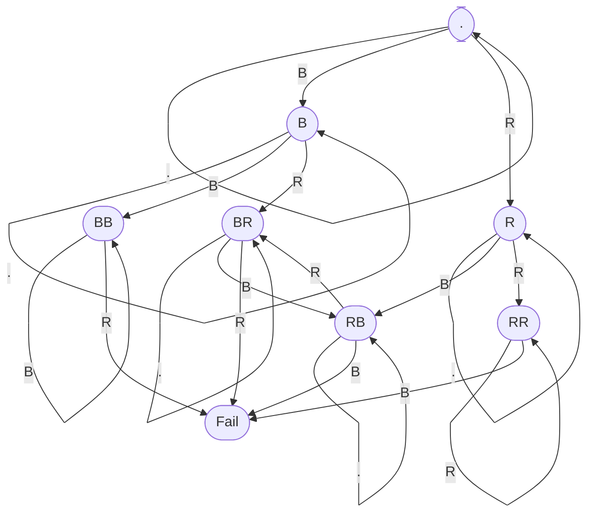

[比赛链接](https://leetcode.cn/contest/season/2023-spring/)

# 个人赛

## T1

简单题，没有卡复杂度，按题意 $O(N^2)$ 模拟即可。

注意这题如果要用堆，得用可删堆，处理起来相对麻烦。比赛中不建议尝试。

## T2

简单题，按题意分割字符串并用哈希表统计即可。

C++没有支持std20，这题比较吃亏。改用js、python过比较容易。

## T3

扫描线遍历题。

题目范围比较小，采用两次扫描线遍历即可。外层在水平方向扫描，每扫描到一个边缘，对所有处在激活态的矩形进行垂直方向的扫描，即可找到最大值。

扫描线可采用event遍历机制，为每个矩形插入一个进入一个退出两个event，将event进行排序，然后顺序遍历。

注意重叠的边缘是记录在内的，因此扫描时要先扫描起点再扫描终点。

## T4

寻路题。

首先从终点开始BFS，可计算出从每个位置距离水晶的距离，或不可达为-1。

接着可根据上述信息，求出 如果在每个位置被传送，传送后的最大距离，或不可达为-1，记为当前格子的代价。

然后从起点开始寻路，若某点别传送后不可达，则对小扣来说不能到达该点。否则，当前格子代价最大的即为整条路径的代价。

因此第二次寻路，可采用堆，尽量去尝试代价较小的格子，直到抵达终点或无路可走为止。

## T5

复杂DP计数题。

要比较顺利的解决这题，首先要想到一种办法来描述当前的状态。

我们考虑用状态机来记录最近的两个棋子颜色：



每列可能有7个状态。可以将该状态机数据化，同时用于行上的合法性判断和列上的状态转移。

```cpp
vector<vector<int>> d = {
    {0, 1, 2},
    {1, 3, 4},
    {2, 5, 6},
    {3, 3, -1},
    {4, 5, -1},
    {5, -1, 4},
    {6, -1, 6},
};
```


题目限制了 $n*m\le 30$ ，当 $n\lt m$ 时，可以将棋盘沿对角线反转以加速运算，此时 $m\le 5$ ，最多有 $7^5=16807$ 个状态。

总复杂度 $7^5*3^5*6$ 考虑实际还有大量的状态在前几层不会发生，且行上的有效状态也小于 $3^5$ ，该复杂度足以通过此题。

还可以使用轮廓线DP，增加一个维度作为当前行的状态，从而在 $7^5\times 7\times 3*5*6$ 复杂度内解决本题。

