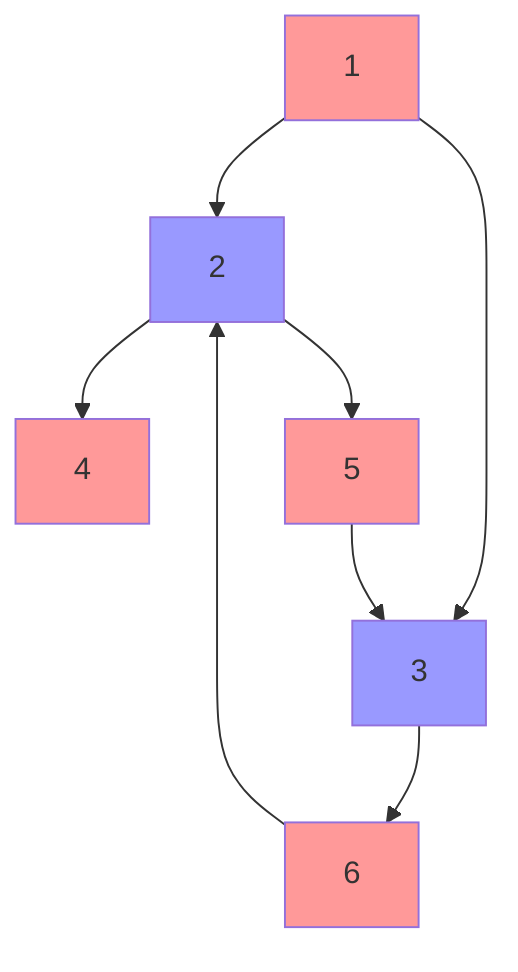
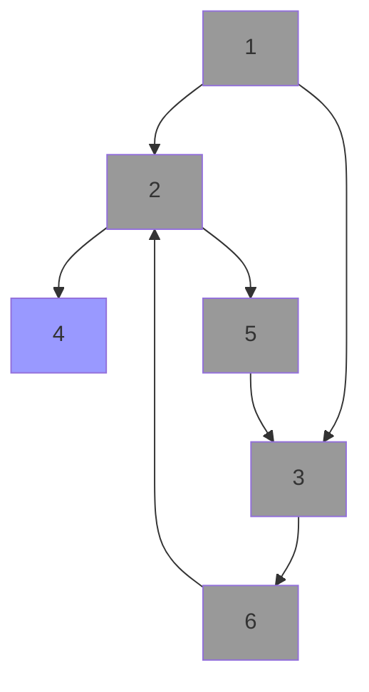

# 猫和老鼠 II

[题目链接](https://leetcode-cn.com/problems/cat-and-mouse-ii/)

0-1 alphabeta

- 必胜：只要存在一种可能让对手处于必败态
- 必败：所有的可能都会让对手处于必胜态
- 和棋：不存在任何可能让对手处于必败态，但是存在可能让对手处于和棋态

- 胜利条件属于必胜态

下图中：如果只已知 4 是必败态，就可以推出 2 是必胜态，最后经过推导 可以确定 1 为必败态



但如果 4 是必胜态，2、5、3、6 都不能确定状态。此时图中已经找不到任何可以确定状态的节点，所以剩下的状态都是和棋态。



所以代码实现的过程中，我们把每一个状态进行编码，方便去处理图，随后去建立整个图的所有边，最后在这个图上循环的去处理 必胜态和必败态，也就是迭代：

- 对于必败态，它的上游（反向边） 都是必胜态
- 对于必胜态，它的上游 如果所有边都通往必胜态（用类似拓扑排序的方法处理，计数-1，如果减到 0 那么处理之），那么它是必败态。

对于终结态的处理，例如“猫操作完之后胜利了”，我们其实应该解读成“猫操作完之后，老鼠失败了”，也就是“猫操作完之后，下一次轮到老鼠操作的状态，是必败态”

```js
const Dirs = [
  [0, 1],
  [0, -1],
  [1, 0],
  [-1, 0],
];

function canMouseWin(grid, catJump, mouseJump) {
  const rows = grid.length;
  const cols = grid[0].length;
  const size = rows * cols;

  // 将状态编码成数字
  function encode(turn, cx, cy, mx, my) {
    const c = cx + cy * cols;
    const m = mx + my * cols;
    return turn * size * size + c * size + m;
  }

  // 预处理下输入，获得地图、猫、老鼠、食物坐标
  const grids = new Array(grid.length).fill(0).map(() => []);
  let cx, cy, mx, my, fx, fy;

  for (let y = 0; y < grid.length; y++) {
    const line = grid[y];
    for (let x = 0; x < line.length; x++) {
      grids[y][x] = 0;
      switch (line[x]) {
        case "#": {
          grids[y][x] = 1;
          break;
        }
        case "C": {
          cx = x;
          cy = y;
          break;
        }
        case "M": {
          mx = x;
          my = y;
          break;
        }
        case "F": {
          fx = x;
          fy = y;
          break;
        }
      }
    }
  }

  // 图和反向图
  const graph = [];
  const revGraph = [];

  // 记录下起始状态，如果该状态已知结果则可以直接返回
  const startPoint = encode(0, cx, cy, mx, my);

  // 待处理的必败态
  const loseStack = [];
  // 待处理的必胜态
  const winStack = [];

  // 建立图和反向图，同时对于结束的状态记录为必败态
  function getEdges() {
    for (let cx = 0; cx < cols; cx++) {
      for (let cy = 0; cy < rows; cy++) {
        if (grids[cy][cx] === 1) {
          continue;
        }
        for (let mx = 0; mx < cols; mx++) {
          for (let my = 0; my < rows; my++) {
            if (grids[my][mx] === 1) {
              continue;
            }

            if (mx === cx && my === cy) {
              // 猫抓到了老鼠，老鼠处于必败态
              loseStack.push(encode(0, cx, cy, mx, my));
            } else if (cx === fx && cy === fy) {
              // 猫先到达了食物，老鼠处于必败态
              loseStack.push(encode(0, cx, cy, mx, my));
            } else if (mx === fx && my === fy) {
              // 老鼠先到达了食物，猫处于必败态
              loseStack.push(encode(1, cx, cy, mx, my));
            }

            {
              const state = encode(0, cx, cy, mx, my);
              const revState = encode(1, cx, cy, mx, my);
              // TODO: 记录状态
              const edges = [];
              const revEdges = [];
              graph[state] = edges;
              revGraph[revState] = revEdges;
              for (const [dx, dy] of Dirs) {
                for (let i = 0; i <= mouseJump; i++) {
                  const mx1 = mx + dx * i;
                  const my1 = my + dy * i;
                  if (mx1 < 0 || my1 < 0 || mx1 >= cols || my1 >= rows) {
                    break;
                  }
                  if (grids[my1][mx1] === 1) {
                    break;
                  }
                  edges.push(encode(1, cx, cy, mx1, my1));
                  revEdges.push(encode(0, cx, cy, mx1, my1));
                }
              }
            }
            {
              const state = encode(1, cx, cy, mx, my);
              const revState = encode(0, cx, cy, mx, my);
              // TODO: 记录状态
              const edges = [];
              const revEdges = [];
              graph[state] = edges;
              revGraph[revState] = revEdges;
              for (const [dx, dy] of Dirs) {
                for (let i = 0; i <= catJump; i++) {
                  const cx1 = cx + dx * i;
                  const cy1 = cy + dy * i;
                  if (cx1 < 0 || cy1 < 0 || cx1 >= cols || cy1 >= rows) {
                    break;
                  }
                  if (grids[cy1][cx1] === 1) {
                    break;
                  }
                  edges.push(encode(0, cx1, cy1, mx, my));
                  revEdges.push(encode(1, cx1, cy1, mx, my));
                }
              }
            }
          }
        }
      }
    }
  }

  //   console.log("startPoint", ...decode(startPoint));

  getEdges();
  const restVectors = graph.map((v) => v && v.length);

  // 类似拓扑排序，分别处理已知的必胜态和必败态， 直到全部处理完毕
  while (winStack.length > 0 || loseStack.length > 0) {
    while (loseStack.length > 0) {
      const state = loseStack.pop();
      //   console.log("lose", ...decode(state));
      for (const neigh of revGraph[state]) {
        if (restVectors[neigh] > 0) {
          if (neigh === startPoint) {
            // 起始点是必胜态，因此老鼠胜利
            return true;
          }
          restVectors[neigh] = 0;
          winStack.push(neigh);
        }
      }
    }

    while (winStack.length > 0) {
      const state = winStack.pop();
      //   console.log("win", ...decode(state));
      for (const neigh of revGraph[state]) {
        if (restVectors[neigh] > 0) {
          if (--restVectors[neigh] === 0) {
            if (neigh === startPoint) {
              // 起始点是必败态，因此老鼠失败
              return false;
            }
            loseStack.push(neigh);
          }
        }
      }
    }
  }

  // 起始态是和棋态，但在题目中规定为老鼠失败
  return false;
}

// console.log(canMouseWin(["####F", "#C...", "M...."], 1, 2));

// console.log(canMouseWin(["M.C...F"], 1, 4));

// console.log(canMouseWin(["M.C...F"], 1, 3));

// console.log(canMouseWin(["C...#", "...#F", "....#", "M...."], 2, 5));

// console.log(canMouseWin([".M...", "..#..", "#..#.", "C#.#.", "...#F"], 3, 1));
```
