# DFA 转正则表达式的方法

首先把 DFA 看做 NFA，所有的边从符号（输入）改为正则表达式，然后进行一系列变形。

## 运算 1

下图中，如 2 没有任何其它边：

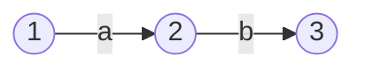

可以简化为

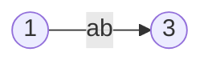

## 运算 2

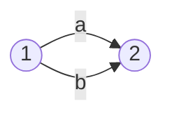

总是可以将两条边简化为一条边

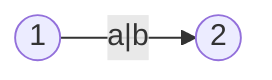

## 运算 3

状态上的自环

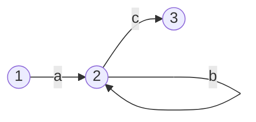

可以进行如下变形：

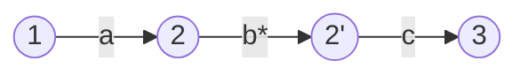

## 运算 4(分配律)

若一个节点有多个输出

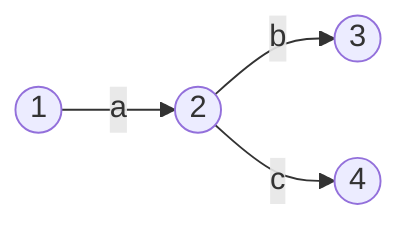

那么可以将该节点分裂成多个节点，输入全连接而输出分开。

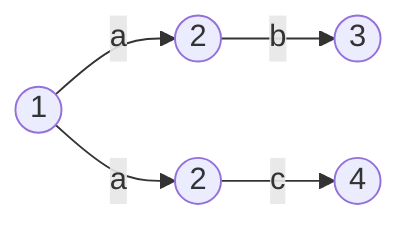

类似的，若一个节点有多个输入

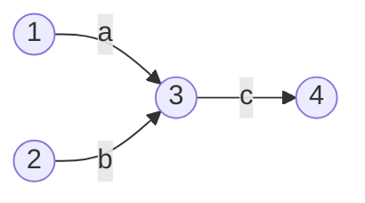

那么可以将该节点分裂成多个节点，输出全连接而输入分开。

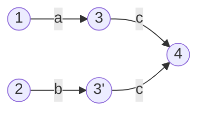

# 奇数个 a 和任意个其它字符组成的字符串

书写 DFA，思路是 1 和 2 状态分别表示偶数个、奇数个 a

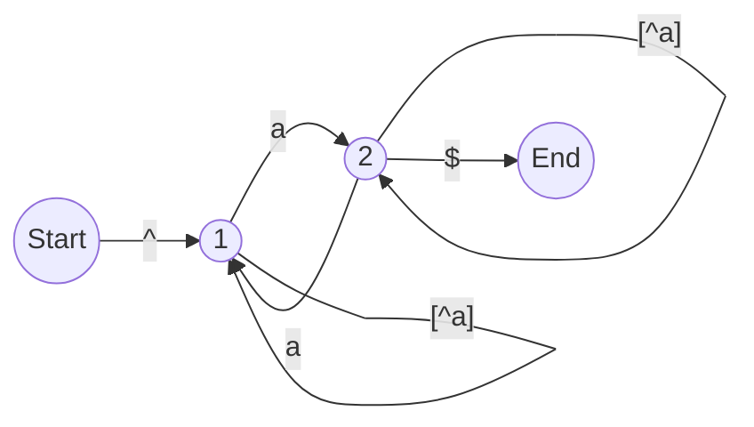

消除自环（分裂节点）然后就近合并

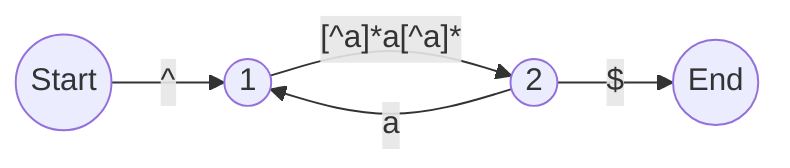

把循环转化成自环

- 运用分配律分裂 2 状态，然后其中一个状态简化成一个自环

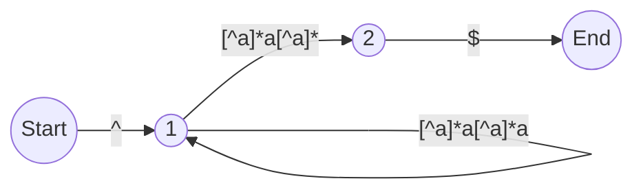

继续消除自环

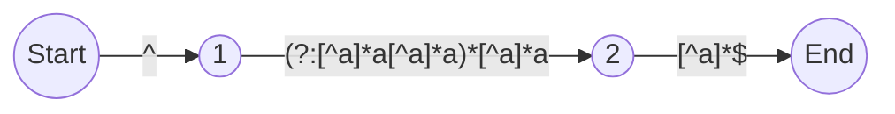

合并所有状态

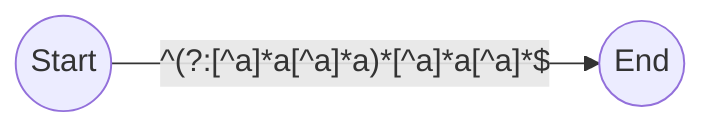

# 不出现连续两个 a 的字符串

首先构建 DFA，1 状态是上一个字符不是 a 的状态，2 是上一个字符是 a 的状态。两个状态都可以直接结束

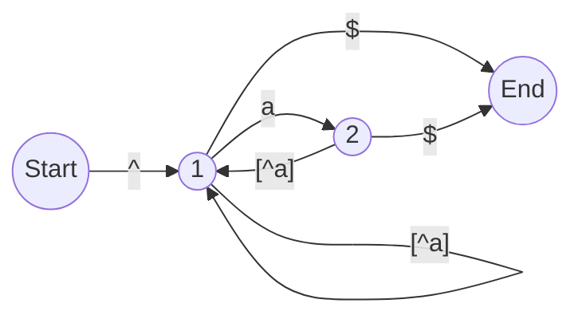

运用分配律分解 2 状态，并化简其中一个状态

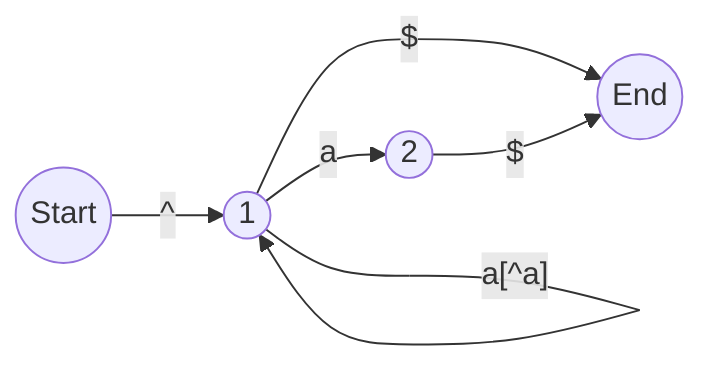

1 右侧的两个状态可以简化

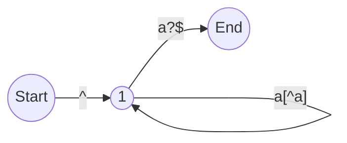

并联的两个自环可以先应用运算 2 再应用运算 3

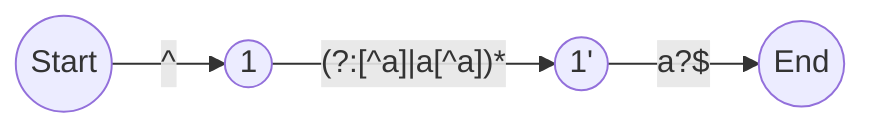

合并，并顺便简化

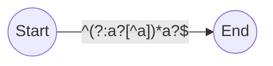
