# 奇数个 a 和任意个其它字符组成的字符串

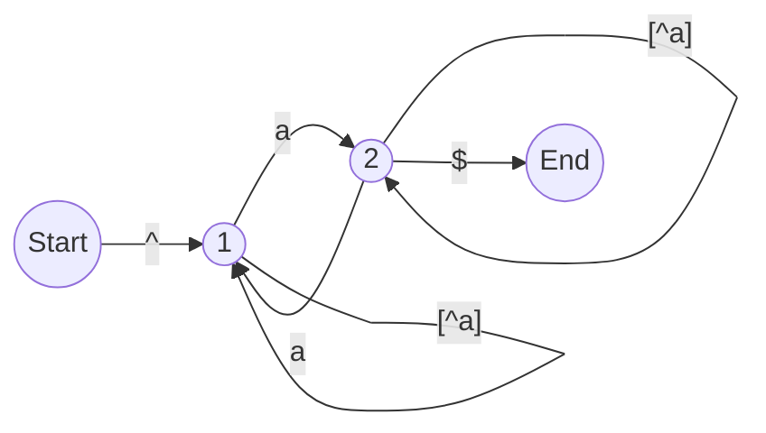
```mermaid
graph LR
    Start((Start))
    1((1))
    2((2))
    End((End))
    Start -- ^ --> 1
    1 -- a --> 2
    1 -- "[^a]" --> 1
    2 -- a --> 1
    2 -- "[^a]" --> 2
    2 -- $ --> End
```

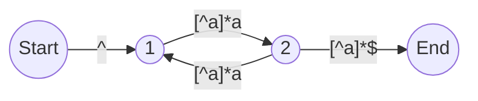
```mermaid
graph LR
    Start((Start))
    1((1))
    2((2))
    End((End))
    Start -- ^ --> 1
    1 -- "[^a]*a" --> 2
    2 -- "[^a]*a" --> 1
    2 -- "[^a]*$" --> End
```

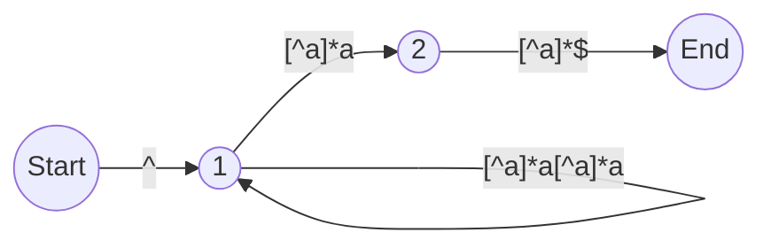
```mermaid
graph LR
    Start((Start))
    1((1))
    2((2))
    End((End))
    Start -- ^ --> 1
    1 -- "[^a]*a" --> 2
    1 -- "[^a]*a[^a]*a" --> 1
    2 -- "[^a]*$" --> End
```

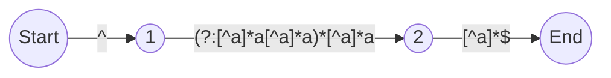
```mermaid
graph LR
    Start((Start))
    1((1))
    2((2))
    End((End))
    Start -- ^ --> 1
    1 -- "(?:[^a]*a[^a]*a)*[^a]*a" --> 2
    2 -- "[^a]*$" --> End
```

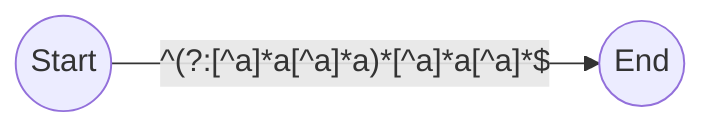
```mermaid
graph LR
    Start((Start))
    End((End))
    Start -- "^(?:[^a]*a[^a]*a)*[^a]*a[^a]*$" --> End
```

# 不出现连续两个 a 的字符串

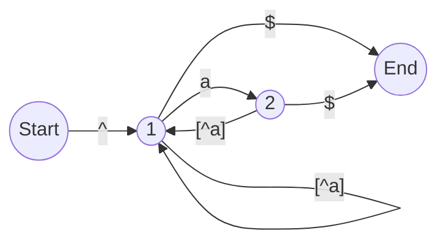
```mermaid
graph LR
    Start((Start))
    1((1))
    2((2))
    End((End))
    Start -- ^ --> 1
    1 -- a --> 2
    1 -- "[^a]" --> 1
    2 -- "[^a]" --> 1
    1 -- $ --> End
    2 -- $ --> End
```

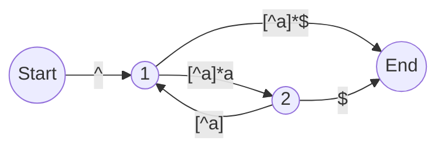
```mermaid
graph LR
    Start((Start))
    1((1))
    2((2))
    End((End))
    Start -- ^ --> 1
    1 -- "[^a]*a" --> 2
    2 -- "[^a]" --> 1
    1 -- "[^a]*$" --> End
    2 -- $ --> End
```

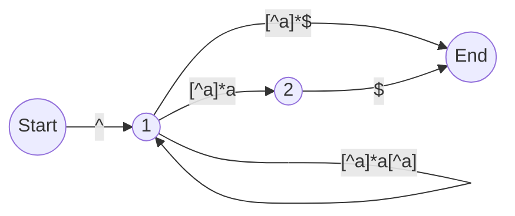
```mermaid
graph LR
    Start((Start))
    1((1))
    2((2))
    End((End))
    Start -- ^ --> 1
    1 -- "[^a]*a" --> 2
    1 -- "[^a]*a[^a]" --> 1
    1 -- "[^a]*$" --> End
    2 -- $ --> End
```

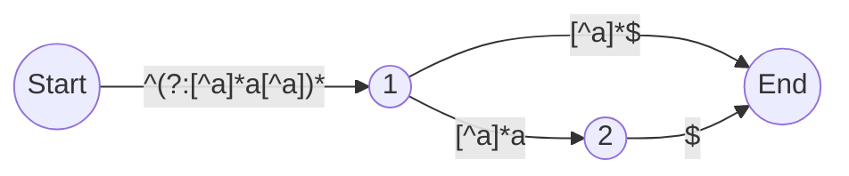
```mermaid
graph LR
    Start((Start))
    1((1))
    2((2))
    End((End))
    Start -- "^(?:[^a]*a[^a])*" --> 1
    1 -- "[^a]*a" --> 2
    1 -- "[^a]*$" --> End
    2 -- $ --> End
```

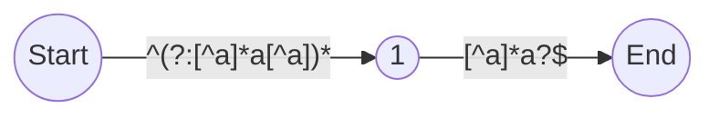
```mermaid
graph LR
    Start((Start))
    1((1))
    End((End))
    Start -- "^(?:[^a]*a[^a])*" --> 1
    1 -- "[^a]*a?$" --> End
```

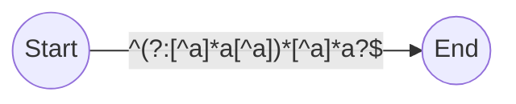
```mermaid
graph LR
    Start((Start))
    End((End))
    Start -- "^(?:[^a]*a[^a])*[^a]*a?$" --> End
```
